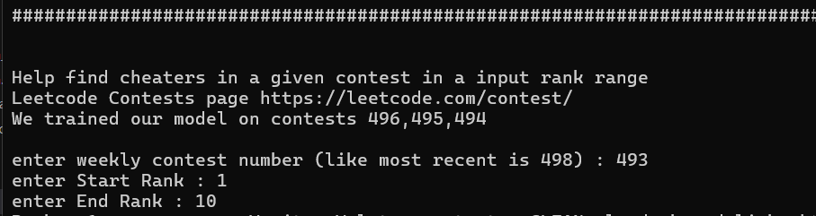
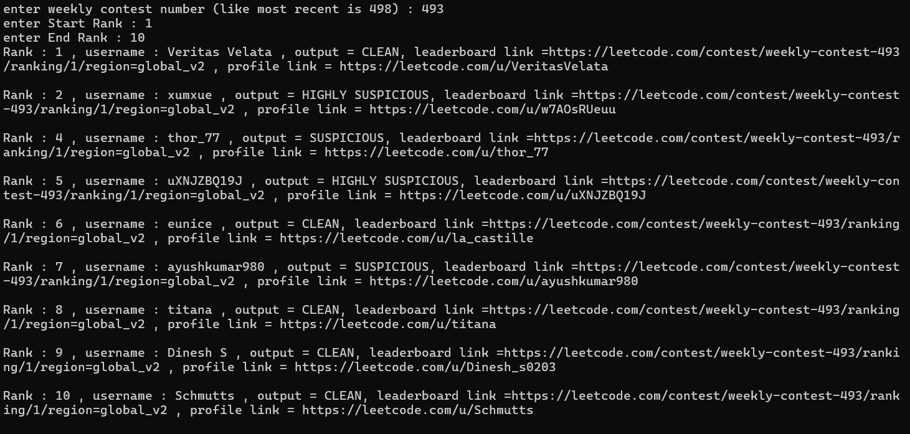
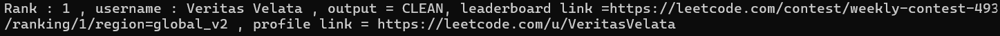

# LEETCODE CONTEST CHEATER DETECTOR

ML Project by 
 - Shivam (2023UEC2581)
 - Karan Sharma (2023UEC2600)
 - Arnav Saxena (2023UEC2607)

## Running the Project

### 1. Clone the repository
     git clone https://github.com/alllhappy/LC_contest_cheater_detector.git

### 2. Go to  Project Root
    cd LC_contest_cheater_detector

### 3. Install dependecies
    pip install -r requirements.txt

### 4. Run the main app
    python -m app.main
# typically takes 1-2 minutes for the app to load and ask for input

# Guide to use the app
currently only supports weekly contest 

### 1. Enter the weekly contest number
see most recent contests from - 
    https://leetcode.com/contest/

### 2. Enter Start Rank to start classification from this rank

### 3. Enter End Rank to end classification till this rank

# Output
It classifies each contest participant into 3 classes Clean,Suspicious and Highly Suspicious indicating increasing chances of cheating by the participant.

# Input Screenshot

# Output ScreenShot

# Understanding Single Output

- Rank : shows rank of participant
- username : shows username of participant
- output : shows our prediction. It can be CLEAN, SUSPICIOUS, HIGHLY SUSPICIOUS
- leaderboard link : LeetCode leaderboard link for current user on the contest page (can visit this to verify)
- profile link : LeetCode profile link for current user (can visit this to verify and analyse)

